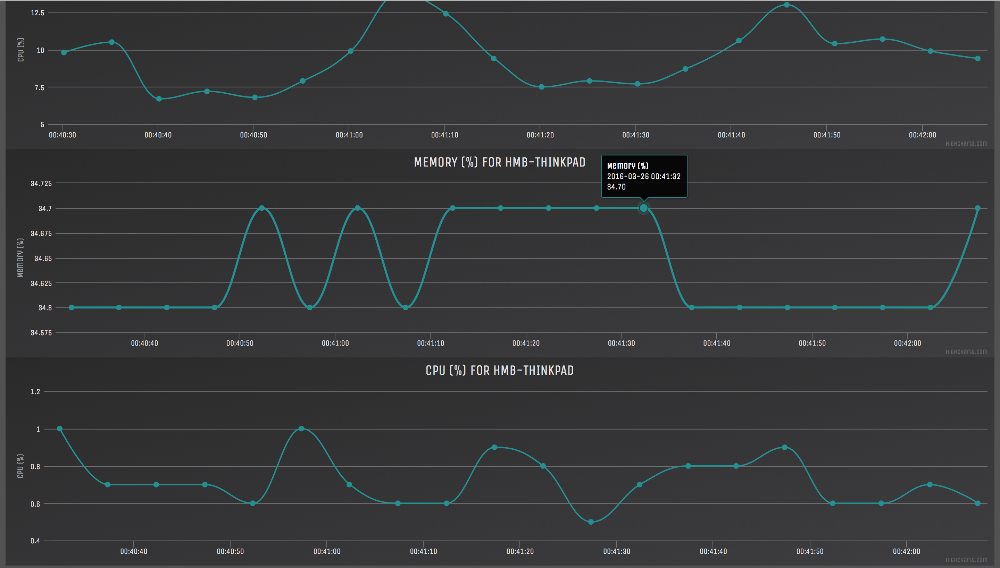

====================
RemoteStats - Client
====================

.. image:: https://img.shields.io/pypi/v/remotestatsclient.svg
        :target: https://pypi.python.org/pypi/remotestatsclient

.. image:: https://img.shields.io/travis/hugombarreto/remotestatsclient.svg
        :target: https://travis-ci.org/hugombarreto/remotestatsclient

.. image:: https://readthedocs.org/projects/remotestatsclient/badge/?version=latest
        :target: http://remotestatsclient.readthedocs.org/en/latest/?badge=latest
        :alt: Documentation Status

RemoteStats makes possible to inspect realtime information about a remote machine using a browser. This is the client to be installed in such machine.

* Free software: ISC license
* Documentation: https://remotestatsclient.readthedocs.org.

Features
--------

* See real time information about many computers in a single interface

* Easily extensible so that many metric may be added in the future

Install
-------

Asumming you have pip installed, you can install the client doing (may need to
use sudo)::

    pip install remotestatsclient

Using
-----

After installing just run relacing with your server address (details about the
server are available on the next section)::

    remotestatsclient <http://server_address>

There is a demo configured on Heroku, hopefully not so many people will find
out, if you want to see your computer stats there run::

    remotestatsclient https://remotestats.herokuapp.com

Now go to https://remotestats.herokuapp.com to see it running.

Server
------

For information about the server, including how to install see RemoteStatsServer_

.. _RemoteStatsServer: https://github.com/hugombarreto/remotestatsserver
